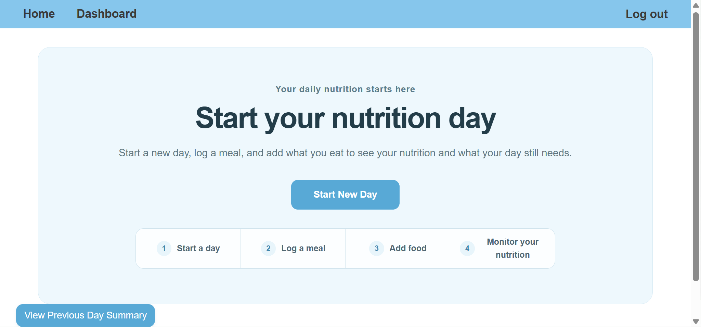
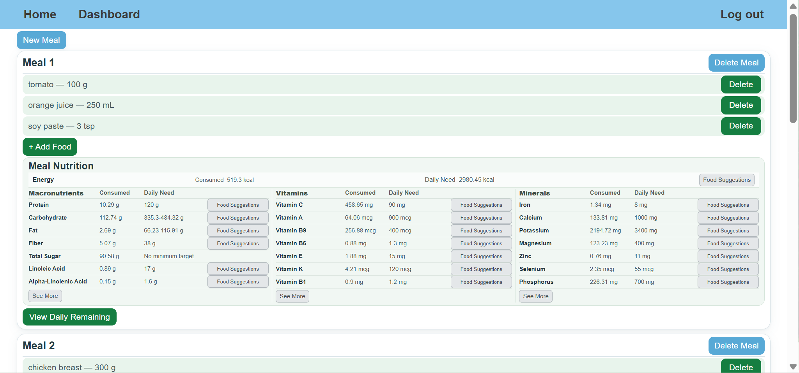
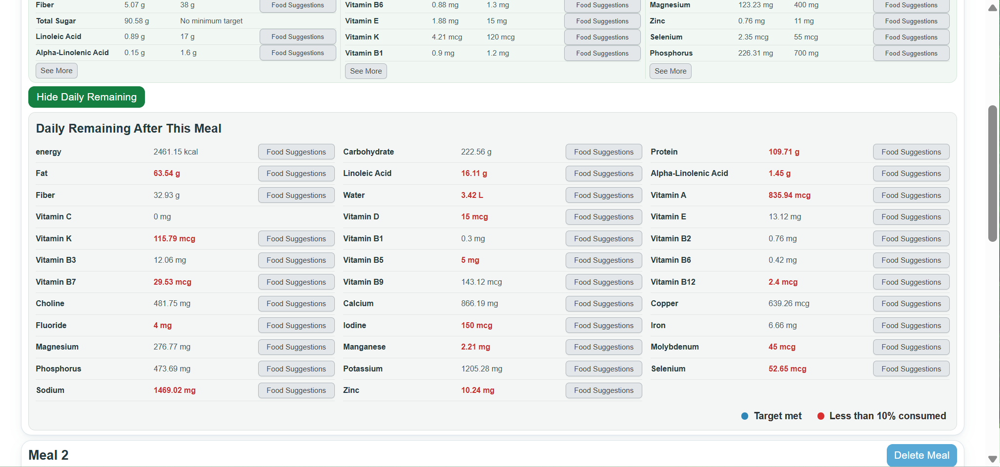
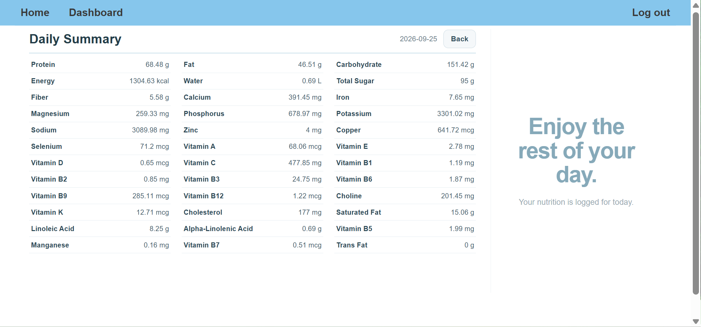
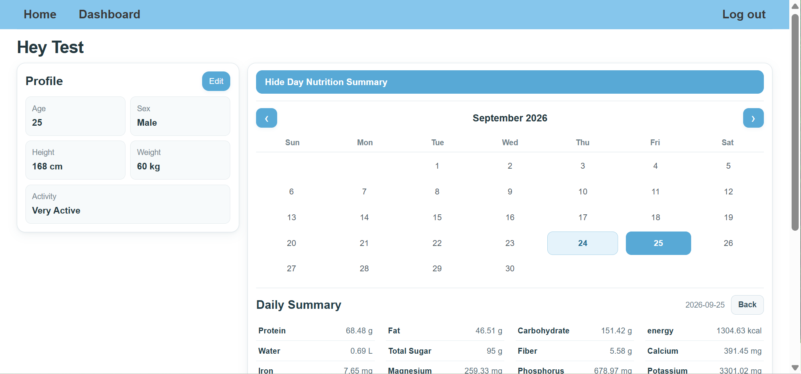
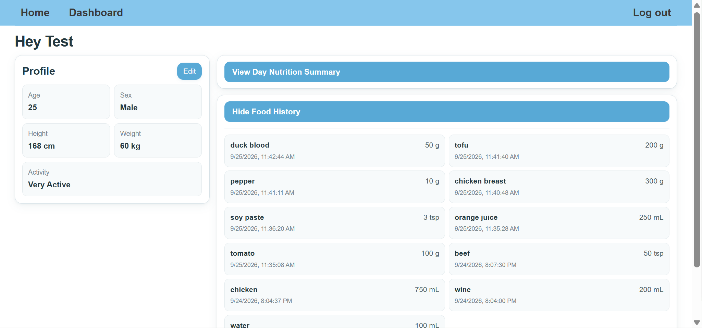

# Daily Nutrition App

A full-stack nutrition tracking web application for logging daily food intake, monitoring personalized nutrient needs, and receiving food suggestions based on remaining nutrition targets.

I built this project around a practical problem: making detailed nutrition tracking useful without requiring users to manually calculate nutrients from every food they eat.



## Features

### Daily Nutrition Tracking

Users can start a nutrition day, create meal sessions, add foods, and monitor nutrient intake throughout the day.

- Organize food entries by daily and meal sessions
- Track energy, macronutrients, vitamins, and minerals
- View nutrition after individual meals
- Compare accumulated intake with personalized daily targets
- Finish a day and review the final nutrition summary



### USDA FoodData Central Integration

The backend integrates with the USDA FoodData Central API to retrieve nutrition data.

The food-processing pipeline:

- prioritizes generic USDA records from Foundation, SR Legacy, and Survey/FNDDS datasets
- normalizes USDA nutrient data into the application's nutrient model
- calculates nutrients based on the amount consumed
- supports `g`, `mL`, `L`, and `tsp`
- converts volume measurements to grams using food-specific measure/density data when available

### Personalized Nutrition

User profiles include:

- age
- sex
- height
- weight
- activity level

The application uses this information to calculate personalized energy and protein targets and age-/sex-based reference values for additional nutrients.

After each meal, users can view what their day still needs.



Food suggestions are also available for nutrients that still need attention.

> Personalized nutrition targets in the current V1 are designed primarily for adults.

### Daily Lifecycle

Nutrition is modeled around explicit day and meal sessions:

```text
User
 └── Day Session
      ├── Meal Session
      │    └── Food Entries
      ├── Meal Session
      │    └── Food Entries
      └── Daily Nutrition Summary
```

A day remains active until it is finished. A 5 AM cutoff allows late-night food logging to remain associated with the previous nutrition day.

After finishing the day, users can review the complete nutrient intake summary.



### Nutrition History

The Dashboard provides profile management and historical nutrition tracking.

Users can select previous days from the calendar and review their recorded nutrient intake.



Food entries are also retained in a separate chronological history.



### Authentication and Persistence

- User registration and login
- Password hashing with bcrypt
- JWT-based authenticated API access
- PostgreSQL-backed persistent data
- User profile creation and editing
- Food and daily nutrition history

## Tech Stack

### Frontend

- React
- TypeScript
- React Router
- Vite
- CSS

### Backend

- Node.js
- Express
- TypeScript
- REST API
- JWT
- bcrypt

### Data and External Services

- PostgreSQL
- Neon
- USDA FoodData Central API

## Architecture

```text
React + TypeScript Client
          │
          │ REST API / JWT
          ▼
Node.js + Express Server
       │          │
       │          └──── USDA FoodData Central
       │
       ▼
PostgreSQL / Neon
```

The backend separates authentication, user profiles, day sessions, meal sessions, food processing, nutrition calculations, and nutrient recommendations into dedicated modules.

The nutrition-processing flow is:

```text
Food query
   ↓
USDA food search
   ↓
Generic food selection
   ↓
Unit / density conversion
   ↓
Nutrient normalization
   ↓
Amount-based nutrient calculation
   ↓
Meal and daily aggregation
   ↓
Comparison with personalized targets
```

## Project Structure

```text
daily-nutrition-app/
├── client/
│   └── src/
│       ├── components/
│       └── pages/
│
├── server/
│   ├── migrations/
│   └── src/
│       ├── auth/
│       ├── days/
│       ├── foods/
│       ├── nutrition/
│       ├── recommendations/
│       └── users/
│
├── images/
└── README.md
```

## Running Locally

### Backend

```bash
cd server
npm install
```

Create a `.env` file:

```env
PORT=3000
DATABASE_URL=your_postgresql_connection_string
USDA_API_KEY=your_usda_fooddata_central_api_key
JWT_SECRET=your_jwt_secret
```

Initialize/configure the PostgreSQL database and then start the backend:

```bash
npm run dev
```

The API runs on port `3000` by default.

### Frontend

```bash
cd client
npm install
```

Create a `.env.local` file:

```env
VITE_API_URL=http://localhost:3000
```

Start the frontend:

```bash
npm run dev
```

## Current Status

**V1 core feature development is complete.**

The primary desktop workflows have been manually tested, including:

- registration and login
- profile creation and editing
- starting and finishing nutrition days
- creating and deleting meals
- adding and deleting foods
- USDA food lookup and nutrient calculation
- meal nutrition summaries
- daily remaining nutrition
- food suggestions
- daily summaries
- nutrition and food history

Production security hardening, deployment, and final mobile/responsive validation are currently in progress.

## Next Steps

- Production authentication and API hardening
- Public deployment
- Mobile/responsive validation
- Further UX refinement based on real usage
- Additional nutrition and food-data capabilities